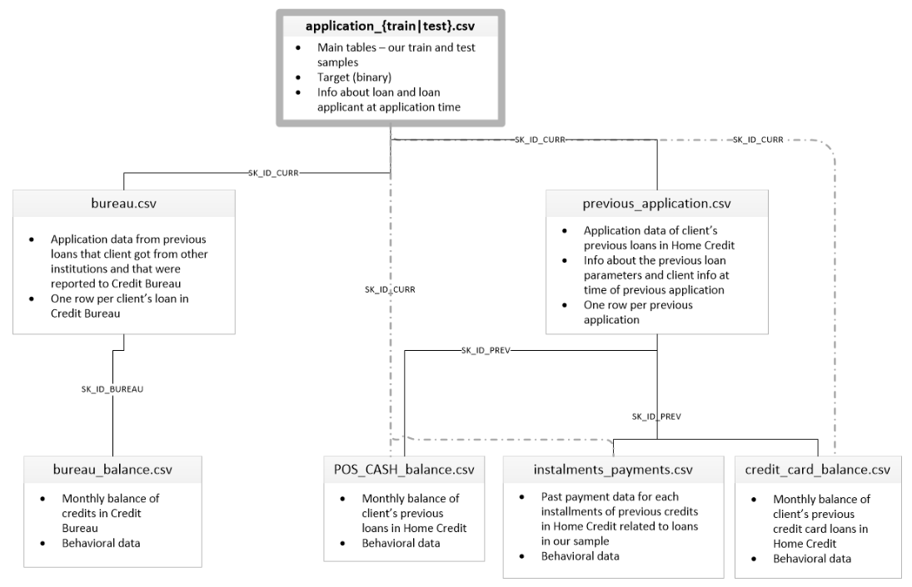

    <h1>Credit scoring (determining the probability of default)</h1>

  

Home Credit strives to broaden financial inclusion for the unbanked population by providing a positive and safe borrowing experience. In order to make sure this underserved population has a positive loan experience, Home Credit makes use of a variety of alternative data - including telco and transactional information - to predict their clients' repayment abilities.

This study was conducted on the basis of data from the Kaggle competition "Home Credit Default Risk", the purpose of which is to use historical data on loan applications and other information to predict whether the applicant will be able to repay the loan (to determine the risk of default of the borrower).

The competition looks like a standard classification task (1 in the TARGET field means any difficulties with payments, 0 - no difficulties). However, it is not 0/1 that should be predicted, but the probability of problems.

Metric: ROC AUC

____

### Dataset Description

  

**application_{train|test}.csv**
* This is the main table, broken into two files for Train (with TARGET) and Test (without TARGET)
* Static data for all applications. One row represents one loan in our data sample

**bureau.csv**
* All client's previous credits provided by other financial institutions that were reported to Credit Bureau (for clients who have a loan in our sample)
* For every loan in our sample, there are as many rows as number of credits the client had in Credit Bureau before the application date

**bureau_balance.csv**
* Monthly balances of previous credits in Credit Bureau
* This table has one row for each month of history of every previous credit reported to Credit Bureau – i.e the table has (#loans in sample * # of relative previous credits * # of months where we have some history observable for the previous credits) rows

**POS_CASH_balance.csv**
* Monthly balance snapshots of previous POS (point of sales) and cash loans that the applicant had with Home Credit
* This table has one row for each month of history of every previous credit in Home Credit (consumer credit and cash loans) related to loans in our sample – i.e. the table has (#loans in sample * # of relative previous credits * # of months in which we have some history observable for the previous credits) rows

**credit_card_balance.csv**
* Monthly balance snapshots of previous credit cards that the applicant has with Home Credit
* This table has one row for each month of history of every previous credit in Home Credit (consumer credit and cash loans) related to loans in our sample – i.e. the table has (#loans in sample * # of relative previous credit cards * # of months where we have some history observable for the previous credit card) rows

**previous_application.csv**
* All previous applications for Home Credit loans of clients who have loans in our sample
* There is one row for each previous application related to loans in our data sample

**installments_payments.csv**
* Repayment history for the previously disbursed credits in Home Credit related to the loans in our sample
* There is a) one row for every payment that was made plus b) one row each for missed payment
* One row is equivalent to one payment of one installment OR one installment corresponding to one payment of one previous Home Credit credit related to loans in our sample

**HomeCredit_columns_description.csv**
* This file contains descriptions for the columns in the various data files

____

### part-1

**This section of the study includes:**
* EDA (Exploratory Data Analysis)
* Baseline and best model, containing
    * Distribution of clients by TARGET classes
    
    

      
    

    * Distribution of clients by level of education

    

      
    

    
    * Distribution of clients by type of income
    
    

      
    

    
    * Distribution of clients by age and TARGET classes
    
    

      
    

    
    * Number of clients in each target class by occupation
    
    

      
    

    
    * Number of clients in each target class by type of organization
    
    

      

____

### part-2
**This section of the study includes:**
* Feature Engineering
* Merging tables
* Machine learning

  

____

### Result
The result of this study corresponds to the Top 10% (bronze medal)

  

